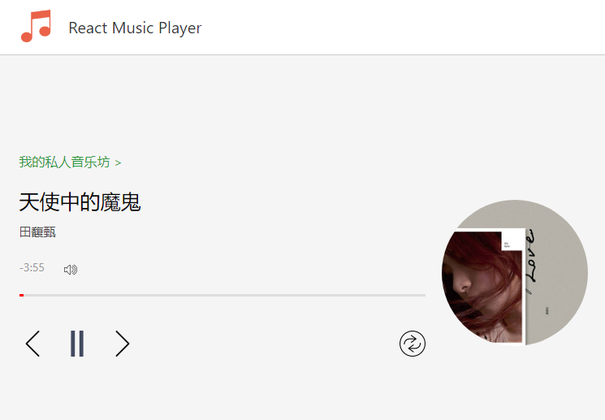
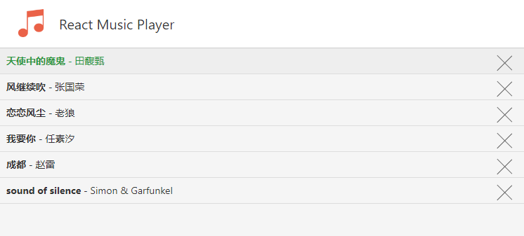
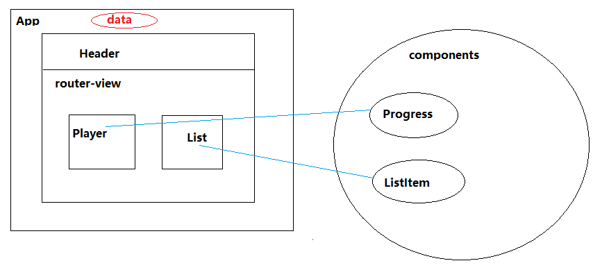

# 技术难点
## 效果图
 

## 页面组件间结构

> 1.为什么要这么设计呢？
> 因为在音乐盒页面播放歌曲时，如果点击切换到歌曲列表页面时，希望音乐还在播放，
> 那么歌曲数据状态状态控制就应该放在App这个父组件来处理，数据从router-view向下传递
> 2.那么对于组件Progress和ListItem来说中间还隔着Player与List，要操作App的数据，看起来有些麻烦
> 传统做法：在Progress里面$emit到Player，然后再由Player.$emit到App，才能修改App的数据，这样做很麻烦，如果嵌套太多的话，非常麻烦
> 高级做法: 使用vuex，来做统一状态管理，这里不明述
> 取巧做法: Vue1.0移除了$dispath,然后在2.3之后又TM添回来了，这TM不按套路出牌，违反了"单向数据流"的原则，而且还会造成混乱，在这里，我们使用事件订阅 this.$root.eventHub.$on
```
-----------------main.js---------------
new Vue({
  el: '#app',
  router,
  store,
  mixins: [historyStack],
  template: '<App :forward="forward" />',
  data: {
    eventHub: new Vue() //在App里面再套用一个vue实例
  },
  components: { App }
})
-----------App.vue-----------
 created(){
     this.$root.eventHub.$on('PLAY_MUSIC', item => {
        this.play(item);
     });
     this.$root.eventHub.$on('DEL_MUSIC', item => {
        this.delete(item);
     });
     ......
 },
  methods: {
     play(item){
        //....
     },
     delete(item){
        //.....
     }
  }
--------------ListItem-------------
methods: {
    playMusic(){
        this.$root.eventHub.$emit('PLAY_MUSIC', this.musicItem);
    },
    deleteHandler(e){
        e.stopPropagation();//因为点击删除时，事件会向上冒泡到playMusic，所以这里要阻止冒泡
        this.$root.eventHub.$emit('DEL_MUSIC', this.musicItem);
    }
}
```
> 这样就实现了跨级组件间通信，多方变

*不过，相对于业务复杂的Vue开发时，建议用vuex*
*开发良好习惯，对于一些DOM的绑定，和事件订阅，记得要在生命周期的destoryed解绑哦*
```
//参考代码片段
created(){
     this.$root.eventHub.$on('PLAY_PN', item => {
        this.playNext(item);
     });
     this.$root.eventHub.$on('PLAY_MUSIC', item => {
        this.playMusic(item);
     });
     this.$root.eventHub.$on('DEL_MUSIC', item => {
        this.delMuisc(item);
     });
  },
  mounted(){
    this.$nextTick(function(){
      //音乐盒插件初始化
      $('#player').jPlayer({
        supplied: "mp3",
        wmode: "window",
        useStateClassSkin: true
      });
      //播放音乐
      this.playMusic(this.currentMusicItem);
      //监听音乐播放完毕
      $('#player').bind($.jPlayer.event.ended, (e) => {
        this.playNext();
      });
    });
  },
  destroyed(){
    $('#player').unbind($.jPlayer.event.ended);
    this.$root.eventHub.$off('PLAY_PN');
    this.$root.eventHub.$off('PLAY_PN');
    this.$root.eventHub.$off('PLAY_MUSIC');
    this.$root.eventHub.$off('DEL_MUSIC');
  },
```